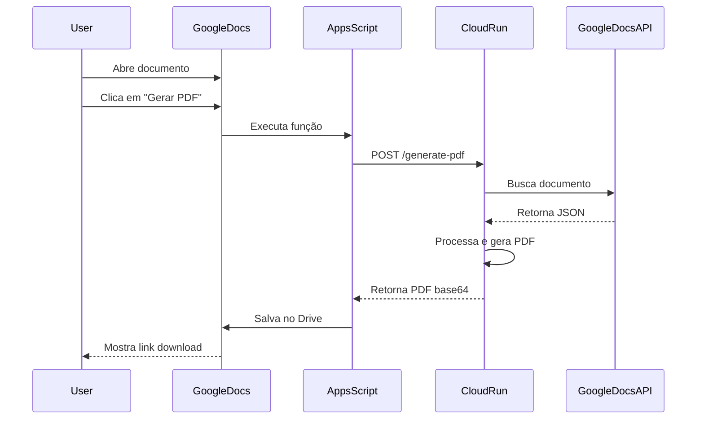

# 📚 Documentação Completa - Sistema LabResumos PDF Generator

## 🎯 Visão Geral do Sistema

Sistema de geração de PDFs profissionais a partir de Google Docs, utilizando Cloud Run para processamento e Google Apps Script para integração.

---

## 🏗️ Arquitetura do Sistema

```
┌─────────────────┐      ┌─────────────────┐      ┌─────────────────┐
│   Google Docs   │─────►│  Apps Script    │─────►│   Cloud Run     │
│   (Frontend)    │◄─────│   (Bridge)      │◄─────│   (Backend)     │
└─────────────────┘      └─────────────────┘      └─────────────────┘
        ↓                         ↓                         ↓
   Documento              Menu/Interface            Processamento
                                                          PDF
```

---

## 📁 Estrutura de Arquivos

### **Local: `/Users/lucasassuncao/Documents/GitLaboratorio/labresumos-scripts/CloudRun/`**

```
CloudRun/
├── app.py                      # API Flask principal
├── processor.py                # Processador de PDF (Python)
├── requirements.txt            # Dependências Python
├── Dockerfile                  # Container Docker
├── service-account-key.json    # Credenciais GCP (PRIVADO!)
├── deploy-config.env          # Configurações de deploy
├── setup_gcp.sh              # Script de setup inicial
├── build-and-deploy.sh       # Script de build e deploy
├── .dockerignore             # Arquivos ignorados no Docker
├── processor_original.py     # Backup do processador original
└── service-url.txt          # URL do serviço Cloud Run
```

---

## 🔧 Detalhamento dos Arquivos

### **1. `app.py` - API Flask Principal**
```python
# Localização: CloudRun/app.py
# Função: Servidor web que recebe requisições e retorna PDFs
```

**Endpoints:**
- `GET /` - Home/Status
- `GET /health` - Health check
- `POST /generate-pdf` - Gera PDF (retorna base64)
- `POST /generate-pdf-stream` - Gera PDF (retorna stream)
- `POST /validate-document` - Valida acesso ao documento

**Variáveis de ambiente:**
- `PORT`: 8080
- `GOOGLE_APPLICATION_CREDENTIALS`: /app/service-account-key.json

---

### **2. `processor.py` - Processador de PDF**
```python
# Localização: CloudRun/processor.py
# Função: Lógica de processamento do Google Docs para PDF
```

**Classes principais:**
- `DocsClient` - Cliente para API do Google Docs
- `DocsJsonParser` - Parser do JSON do Docs
- `PDFRenderer` - Renderizador de PDF
- `ParsedDoc` - Modelo de documento parseado
- `LabResumosAPIApp` - Aplicação principal

**Funções auxiliares:**
- `load_credentials()` - Carrega credenciais GCP
- `extract_doc_id()` - Extrai ID do documento
- `generate_qr_code()` - Gera QR codes
- `generate_line_chart()` - Gera gráficos de linha
- `generate_pie_chart()` - Gera gráficos de pizza
- `generate_bar_chart()` - Gera gráficos de barras

---

### **3. `requirements.txt` - Dependências**
```txt
# Localização: CloudRun/requirements.txt
```

**Principais bibliotecas:**
- Flask (3.0.0) - Framework web
- flask-cors (4.0.0) - CORS support
- gunicorn (21.2.0) - Servidor WSGI
- google-api-python-client - APIs Google
- WeasyPrint (60.2) - Geração de PDF
- Plotly (5.18.0) - Gráficos
- qrcode - QR codes

---

### **4. `Dockerfile` - Container**
```dockerfile
# Localização: CloudRun/Dockerfile
```

**Configurações:**
- Base: `python:3.11-slim`
- Porta: 8080
- Workers: 2
- Threads: 8
- Timeout: 300s

---

### **5. Scripts de Automação**

#### `setup_gcp.sh`
```bash
# Localização: CloudRun/setup_gcp.sh
# Função: Setup inicial do projeto GCP
```
- Cria projeto
- Habilita APIs
- Cria Service Account
- Configura permissões
- Cria repositório Docker

#### `build-and-deploy.sh`
```bash
# Localização: CloudRun/build-and-deploy.sh
# Função: Build e deploy automatizado
```
- Build Docker image
- Push para Artifact Registry
- Deploy no Cloud Run
- Testa serviço

---

## 🌐 URLs e Endpoints

### **Cloud Run Service**
```
URL Base: https://labresumos-pdf-generator-457320028768.southamerica-east1.run.app
```

### **Endpoints Disponíveis:**
```
GET  https://labresumos-pdf-generator-457320028768.southamerica-east1.run.app/health
POST https://labresumos-pdf-generator-457320028768.southamerica-east1.run.app/generate-pdf
POST https://labresumos-pdf-generator-457320028768.southamerica-east1.run.app/validate-document
```

---

## ☁️ Configurações Google Cloud Platform

### **Projeto GCP**
```yaml
Project ID: labresumos-pdf
Region: southamerica-east1
```

### **Service Account**
```yaml
Email: labresumos-pdf-sa@labresumos-pdf.iam.gserviceaccount.com
Key File: service-account-key.json
```

### **Artifact Registry**
```yaml
Repository: labresumos-repo
Location: southamerica-east1
Format: Docker
```

### **Cloud Run Service**
```yaml
Service Name: labresumos-pdf-generator
Memory: 2Gi
CPU: 2
Max Instances: 10
Min Instances: 0
Timeout: 300s
```

### **APIs Habilitadas**
- Cloud Run API
- Cloud Build API
- Artifact Registry API
- Google Docs API
- Google Drive API
- Secret Manager API

---

## 📝 Google Apps Script

### **Localização no Google Docs**
```
Extensões > Apps Script > PDFCloudRun.gs
```

### **Arquivo: `PDFCloudRun.gs`**

```javascript
// Configuração principal
const CLOUD_RUN_CONFIG = {
  SERVICE_URL: 'https://labresumos-pdf-generator-457320028768.southamerica-east1.run.app',
  TIMEOUT: 300000,
  MAX_DOC_SIZE: 500000
};
```

### **Funções Principais:**
- `onOpen()` - Cria menu no Docs
- `testCloudRunConnection()` - Testa conexão
- `generatePDFWithCloudRun()` - Gera PDF via Cloud Run
- `getDocumentInfo()` - Obtém info do documento
- `showPDFDialog()` - Mostra dialog de geração

### **Menu no Google Docs:**
```
📊 LabResumos Tools
  ├── 🎨 Gerar Diagrama
  ├── ─────────────────
  ├── 📄 Gerar PDF (Teste)
  ├── ⚡ PDF Rápido
  ├── ─────────────────
  ├── ✅ Testar Conexão
  └── ℹ️ Sobre
```

---

## 🚀 Comandos de Deploy

### **Build e Deploy Completo**
```bash
# Da pasta CloudRun/
./build-and-deploy.sh
```

### **Build Manual**
```bash
docker buildx build \
  --platform linux/amd64 \
  --tag southamerica-east1-docker.pkg.dev/labresumos-pdf/labresumos-repo/pdf-generator:latest \
  --push \
  .
```

### **Deploy Manual**
```bash
gcloud run deploy labresumos-pdf-generator \
    --image=southamerica-east1-docker.pkg.dev/labresumos-pdf/labresumos-repo/pdf-generator:latest \
    --platform=managed \
    --region=southamerica-east1 \
    --allow-unauthenticated \
    --memory=2Gi \
    --cpu=2 \
    --timeout=300
```

---

## 🔍 Comandos de Diagnóstico

### **Ver logs do Cloud Run**
```bash
gcloud run services logs read labresumos-pdf-generator \
    --region=southamerica-east1 \
    --limit=50
```

### **Testar health check**
```bash
curl https://labresumos-pdf-generator-457320028768.southamerica-east1.run.app/health
```

### **Ver status do serviço**
```bash
gcloud run services describe labresumos-pdf-generator \
    --region=southamerica-east1
```

### **Listar revisões**
```bash
gcloud run revisions list \
    --service=labresumos-pdf-generator \
    --region=southamerica-east1
```

---

## 🔐 Permissões Necessárias

### **Para o Google Docs:**
1. Compartilhar documento com: `labresumos-pdf-sa@labresumos-pdf.iam.gserviceaccount.com`
2. Permissão: Visualizador

### **IAM Roles da Service Account:**
- `roles/run.invoker` - Invocar Cloud Run
- `roles/drive.viewer` - Ler Google Drive
- `roles/secretmanager.secretAccessor` - Acessar secrets

---

## 📊 Fluxo de Dados



---

## 🐛 Troubleshooting

### **Erro: Service Unavailable**
```bash
# Verificar logs
gcloud run services logs read labresumos-pdf-generator --region=southamerica-east1 --limit=50

# Verificar se o container está rodando
gcloud run services describe labresumos-pdf-generator --region=southamerica-east1
```

### **Erro: Permission Denied**
```bash
# Verificar Service Account
gcloud iam service-accounts list

# Adicionar permissão
gcloud projects add-iam-policy-binding labresumos-pdf \
    --member="serviceAccount:labresumos-pdf-sa@labresumos-pdf.iam.gserviceaccount.com" \
    --role="roles/drive.viewer"
```

### **Erro: Module not found**
```bash
# Rebuild com cache limpo
docker system prune -f
./build-and-deploy.sh
```

---

## 📈 Monitoramento

### **Métricas no Console**
```
https://console.cloud.google.com/run/detail/southamerica-east1/labresumos-pdf-generator/metrics
```

### **Logs no Console**
```
https://console.cloud.google.com/logs/query;service=labresumos-pdf-generator
```

---

## 💰 Custos Estimados

| Recurso | Uso Mensal | Custo Estimado |
|---------|------------|----------------|
| Cloud Run | 100 PDFs/dia | $10-18 USD |
| Artifact Registry | 1GB storage | $0.10 USD |
| Secret Manager | 10k acessos | $0.06 USD |
| **Total** | - | **~$18 USD/mês** |

---

## 🔄 Atualizações Futuras

### **Para adicionar o processador completo:**

1. **Restaurar processor.py original:**
```bash
cp processor_original.py processor.py
# Corrigir sintaxe: substituir ** por __
```

2. **Atualizar requirements.txt completo:**
```bash
# Adicionar todas as dependências do WeasyPrint, Plotly, etc
```

3. **Rebuild e deploy:**
```bash
./build-and-deploy.sh
```

---

## 📞 Contatos e Suporte

- **Projeto GCP:** labresumos-pdf
- **Email Service Account:** labresumos-pdf-sa@labresumos-pdf.iam.gserviceaccount.com
- **Região:** southamerica-east1 (São Paulo)

---

## ✅ Checklist de Manutenção

- [ ] Verificar health check semanalmente
- [ ] Monitorar logs de erro
- [ ] Atualizar dependências mensalmente
- [ ] Fazer backup do service-account-key.json
- [ ] Verificar custos no GCP Console
- [ ] Testar geração de PDF após mudanças

---

**Última atualização:** 24/08/2025  
**Versão:** 1.0.0  
**Status:** Em desenvolvimento (versão simplificada rodando)